# Create a Git Project

Git is a version control system which is mainly used by developers to version codes. In this section we'll cover the 
following items:

1. What is Git?
2. What can Git do?
3. How to create a project and control its versions using git?
4. How to check a project's git history?
5. How to move backward and forward between versions?
6. How to add our project to a remote server[GitHub]?


## What is Git?
Git is an open-source version control system initially developed in 2005 by Linus Torvalds. 
It's, by far, the most used VCS in the world. 
It provides features for developers enabling them to control different versions of their files and codes. 

## What can Git do?
Git is mainly used because of following reasons
* Go back and forth between versions or changes which are made
* Check change history
* review changes between different versions 
* several other features which we'll review in the next chapters.

## How to create a project and control its versions using git
To start a Git based project. First, we need to install it:</br>
### Installation
linux users:
```commandline
sudo apt-get install git
```
Windows users:</br>
Download git from the following link and install it.</br>
[git download link](https://git-scm.com/downloads)
</br>Use the default options and install it.

Then, open a terminal/cmd and run the following command to start a project:

```commandline
mkdir git_01 # change git_01 to your desired project's name
cd git_01 # change directory
git init # Initialize a new git database
```
If everything goes fine, you should be able to see a file named `.git` in your project's directory.</br>
The output should also be like below:</br>
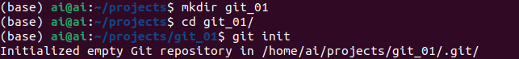

### Now, let's create our first file.

```commandline
touch Readme.md # If your are on Windows, simply create a text file and change its name and extension to Readme.md
git status # to check the status of your project
```
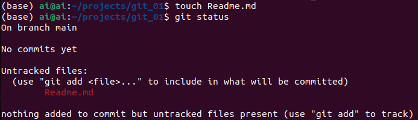

**Image Notes:**
1. branch name: main
   1. In a git project, one create multiple branches, we'll get to it. 
   2. Your branch name might be master. 
   3. run `git branch -M main` to rename your branch to `main` as well.
2. No commits yet: We'll create a commit soon
3. untracked files: Readme.md
   1. untracked files are those which are not added to git's staging area. They are not part of git. They are kind of dangling files.
   2. Staging Area: the staging area is where you put your `modified codes/files` before `versioning it` or before taking snapshots from them.
   3. To add a file to staging area use `git add <file-name-0> <file-name-1> ...`
   4. Note: you don't need to add every file you have to the staging area. Only add those that you want to take snapshot or create a version of it.

### So let's add our first file to the staging area.

```commandline
git add Readme.md # Add to the staging area
git status # Use this each time you make a change. It's a lifesaver. 
```
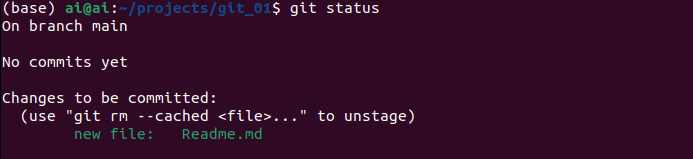

**Image Notes:**
1. Changes to be committed: new file: Readme.md
   1. There is only one new file which can be committed.
   2. Commit: Committing a staged file means that you are creating version of it and adding it to the git's database at the same time.
   3. After committing a file, you can access that version anytime you desire(we'll see how to access different versions)
2. How to remove a file from staging area: `git rm --cached <file-name-0> <file-name-1>...`
   1. Note:**By using this command the file will be removed from future versions. It's as if it was not existed ever!**

### Let's create our first commit:
Commit structure is as follows:
```commandline
# git commit -m commit-message
# ex:
git commit -m "Add Readme.md"
git status  
```

The output should be like below if you had only `Readme.md` in your project's directory:</br>
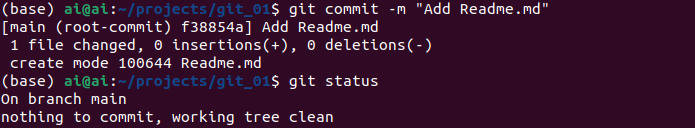
**Image Notes:**
1. [main f38854a] Add Readme.md: [branch-name commit-hash] commit message
   1. Your commit-hash might differ than mine! 
2. 1 file changed, 0 insertions(+), 0 deletions(-)
   1. We created a file
   2. we didn't delete or insert anything to any file


That's it. We have now the first version of our file. 

Note: 
</br>Before your first commit, you will be asked to enter your a commit email.</br>
Enter the email that you are going to create a GitHub account and the username that you want to use for your GitHub.

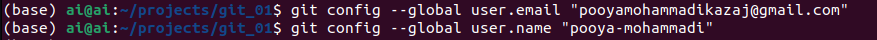

You can change them at any time...

### Let's make a change and commit it as well as the previous one.

```commandline
# open Readme.md using a text editor and add the following line
# # Introduction to Git
# an empty line
git status
```
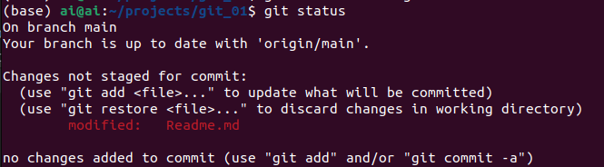
```commandline
git add Readme.md # Before commiting a file, you should add it to stating area.
git status
```
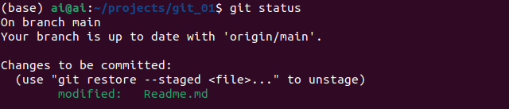

**Image Notes:**
1. I used nano to modify Readme.md(a linux app for editing text files)
2. Changes to be committed: It means that you have added some files to staging area, and it's ready to be committed.
3. If you don't want to include the newly applied changes to your file, you can simply restore it using `git restore --staged <file-name-01> <file-name-02> ...`
   1. This command removes the changed file from the staging area. **It does not remove the whole file from git cache or future commits as in the previous command** 

```commandline
git commit -m "Add header Readme.md" # try to add an informative commit message(we'll talk about it in the next notes)
git status # an inseparable part of our commands :)
```

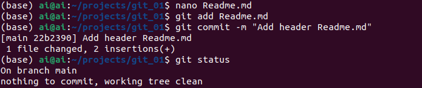

**Image Notes:**
1. I used nano to modify Readme.md(a linux app for editing text files)
2. [main 22b2390] Add header Readme.md: [branch-name commit-hash] commit message
   1. commit-hash is a unique code used for labeling different versions.
3. 1 file changed, 2 insertions(+)
   1. We changed one file and inserted two lines to `Readme.md`
   2. First line was the header
   3. The second line was an empty new line. Yours might be `1 insertions(+)` which is ok...

So far, we have created two versions. Let's step to the next section and check the history.

## How to check a project's git history
To check git history of project run the following command:
```commandline
git log --oneline
```

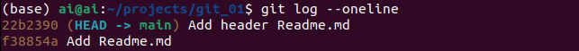

**Image Notes:**
1. commit-hash commit-message
2. All the commits with their hash-codes and their messages are shown
3. (HEAD -> main) -> this shows the latest version of your project and its branch name.

## How to move backward and forward between versions
It does not matter in which direction you want to go. You only should have the hash-code.

```commandline
git checkout hash-code
```
Let's get back to the first commit:
```commandline
git checkout f38854a 
```
Note: your commit-hash may differ, use your own. To fetch all your git's history, check the previous section.</br>
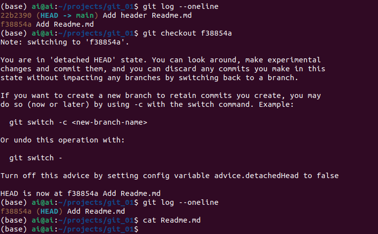

**Image Notes: This time let's start from the end**
1. The `Readme.md` contains nothing, as if we have not added anything to it. # you can open Readme.md using your favorite text editor.
2. The history show's only one line because each version/commit has its own history which depicts what's **prior** to it.
3. HEAD is now at f38854a Add Readme.md -> show's on which commit-hash the git is.
4. `detached HEAD`: It means that this is not an independent branch like `main`(yours might be `master`).
   1. It's not recommended to make change on `detached HEAD` because it can cause several issues. Its intention is to let you look around and so on.
   2. If you want to make commits on this state and retain them you should create a new branch(we'll talk about it).

### How to get back where we were before `checkout`
```commandline
git checkout main # your branch name(yours might be `master`)
```
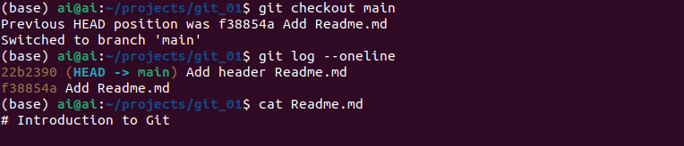

Everything is back to the way we left. It's amazing!

## How to add our project to a remote server[GitHub]
### Why do we need a remote server
1. To make sure our projects don't get lost due to computer crashes.
2. We can share it with others 
3. We can do teamwork
4. We can get help from others
5. and so on...
### How to set one
First, create an account on GitHub. Then Log in to your page.</br>  
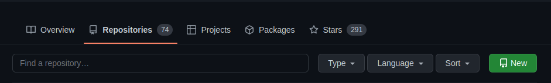
Click on the new button to create a new project.</br> 
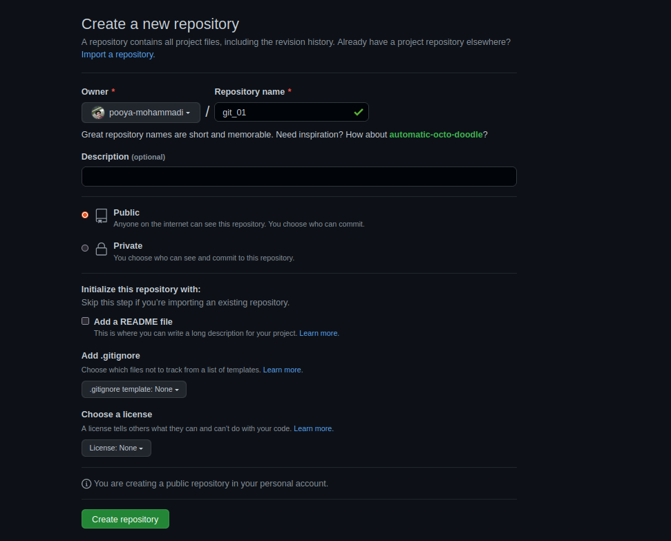

**Image Notes: **
1. Repository name should be unique comparing to your other projects
2. You can create a public, which every can see, or a private project, which only you can see it.
3. You can check Add a README file. I have not checked it because we have already one Readme.md file.
4. We'll discuss the rest later.

Click on `Create repository` button. Then you'll see the following image:
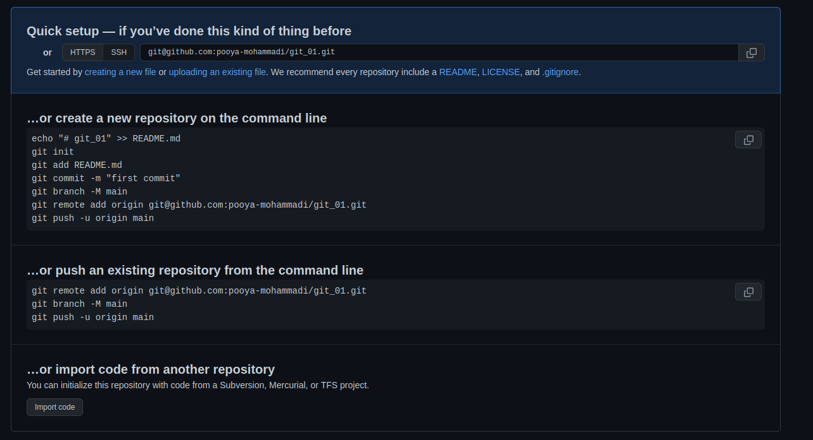

**Image Notes: **
1. or HTTPS/SSH
   1. These two indicate how you establish your connection with the remote server.
   2. By default, it is set to `SSH`
      1. The Secure Shell Protocol (SSH) is a cryptographic network protocol for operating network services securely over an unsecured network.[Wikipedia](https://en.wikipedia.org/wiki/Secure_Shell)
      2. In this part we'll continue with `SSH`
2. ...create a new repository on the command line:
   1. We checked how to create a `Readme.md` file and how to commit
   2. The last three lines show how to change your branch name to `main`, how to add a remote server to a local git, and how to `push`/send our codes to the remote server
3. ...or push an existing repository from the command line
   1. What we have done so far lies in this category
   2. The first line is used to add a new remote
   3. The second line renames your branch 
   4. the third line pushes/sends the files to remote server

So let's add the remote server:
```commandline
git remote add origin git@github.com:pooya-mohammadi/git_01.git
```
Note: your remote server's name can be other than `origin`. By convention everyone chooses `origin` as their remote servers name.

You can rename your branch if it's not `main`
```commandline
git branch -M main
```

Then, push your commits to the remote server:
```commandline
git push -u origin main
```
You will get a message as below:</br>
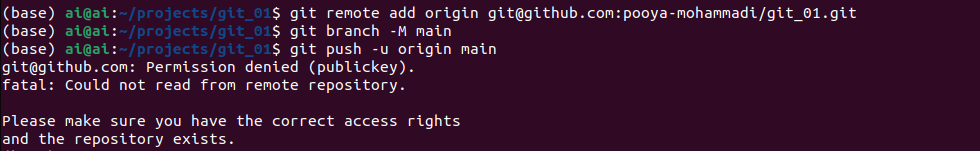

**Image notes:**
1. As it is clear in the image, the server blocks the request because we have not set the publickey.
2. You can consider than the correct credentials are not set, so the remote server does not authenticate our push request and does not consider it valid.

**Note:**

### Let's assign public key to GitHub
linux users:
```commandline
sudo apt-get install openssh-server # install
sudo systemctl enable ssh # enable
sudo systemctl start ssh # start

ssh-keygen # generates a public key. You can specify a name or simply follow the defaults using enter key.
cat ~/.ssh/id_rsa.pub 
```
Windows users:</br>
Open Powershell and enter the following command:
</br>[how to install ssh on Windows reference](https://docs.microsoft.com/en-us/windows-server/administration/openssh/openssh_install_firstuse?tabs=powershell)
```commandline
(New-Object Security.Principal.WindowsPrincipal([Security.Principal.WindowsIdentity]::GetCurrent())).IsInRole([Security.Principal.WindowsBuiltInRole]::Administrator)
Get-WindowsCapability -Online | Where-Object Name -like 'OpenSSH*'
ssh-keygen.exe # generates a public key. You can specify a name or simply follow the defaults using enter key.
cat ~\.ssh\id_rsa.pub
```
The last line prints out the public key. Copy the key.
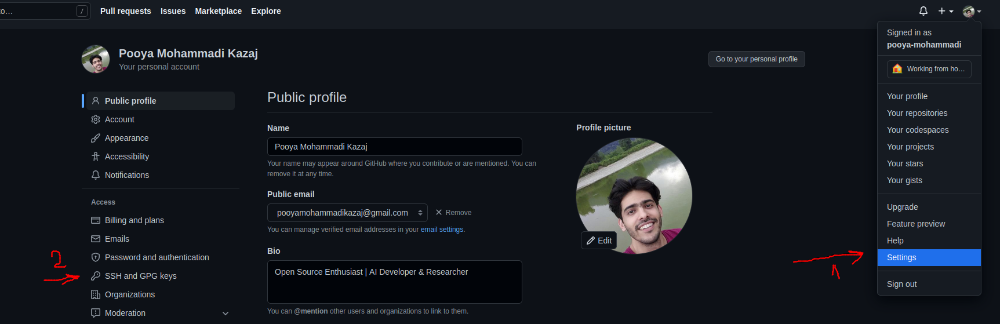

**Image Note:**
1. First, click on `settings`
2. Then, click on `SSH and GPG keys`
3. On the new page, click on `New SSH key`
4. Add a Title(it could be anything)
5. Paste your publickey in the box titled Key
6. And, Click on Add SSH key

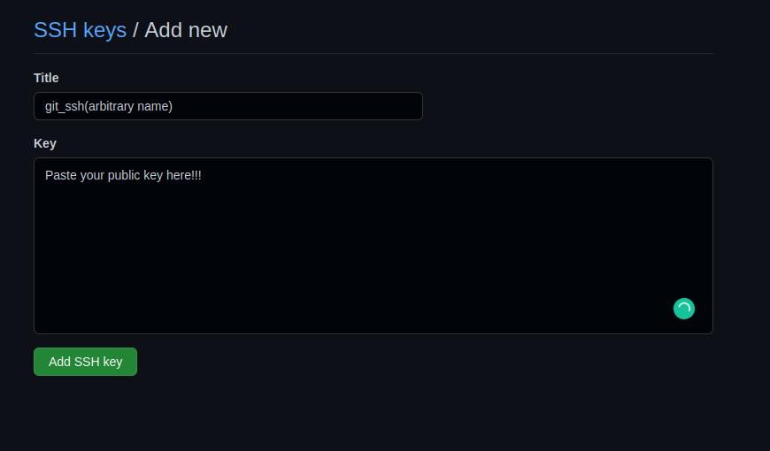

Then, run the push command again:
```commandline
git push -u origin main
```

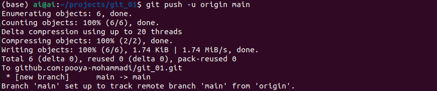

Finally, refresh the main page of your project you should be able to see that Readme.md is uploaded.
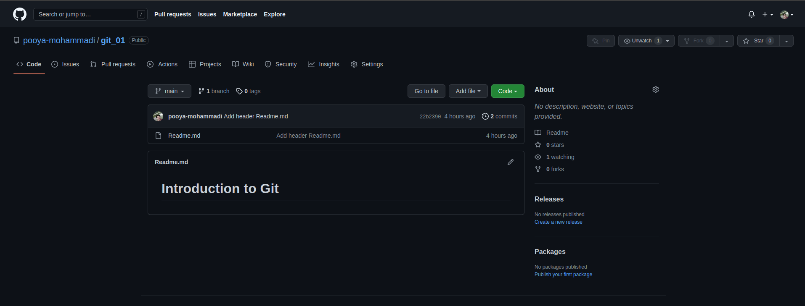

Note:
> The `-u` flag is used to set origin as the upstream remote in your git config.
As you push a branch successfully or up to date it, it adds upstream reference.</br>
As you push local branch with (the)`git push -u` option, that local branch is linked with the remote branch automatically.
</br>The advantage is, you may use `git pull` without any arguments.
[link to note's reference](https://www.interglobalmedianetwork.com/blog/2020-02-15-the-importance-and-advantage-of-git-push-u)

We'll get to pull later. 
