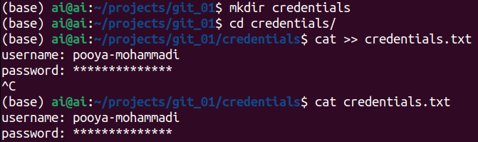
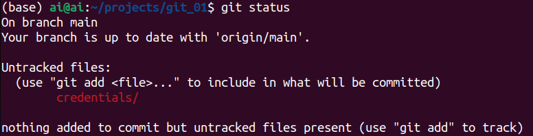
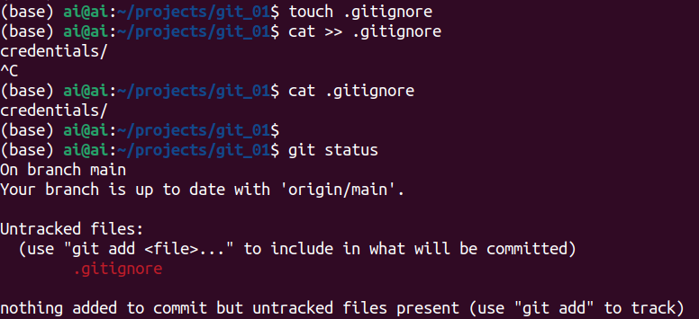
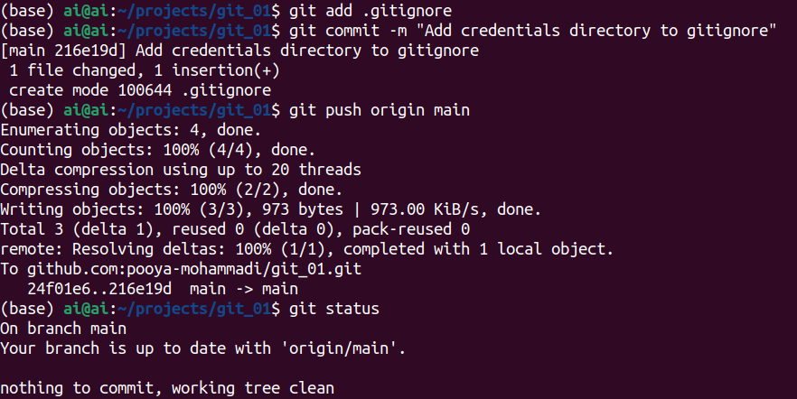
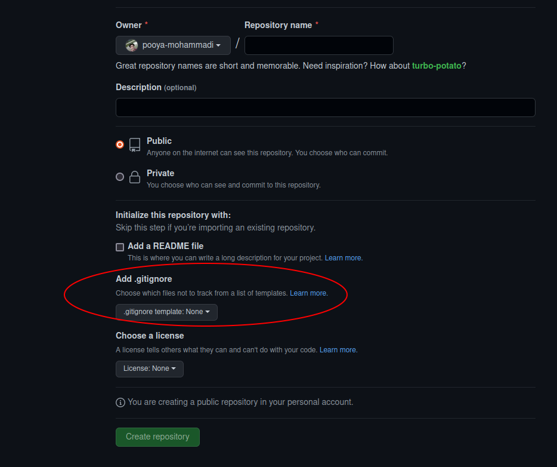
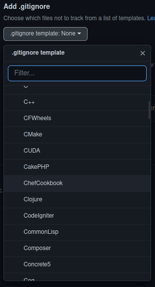
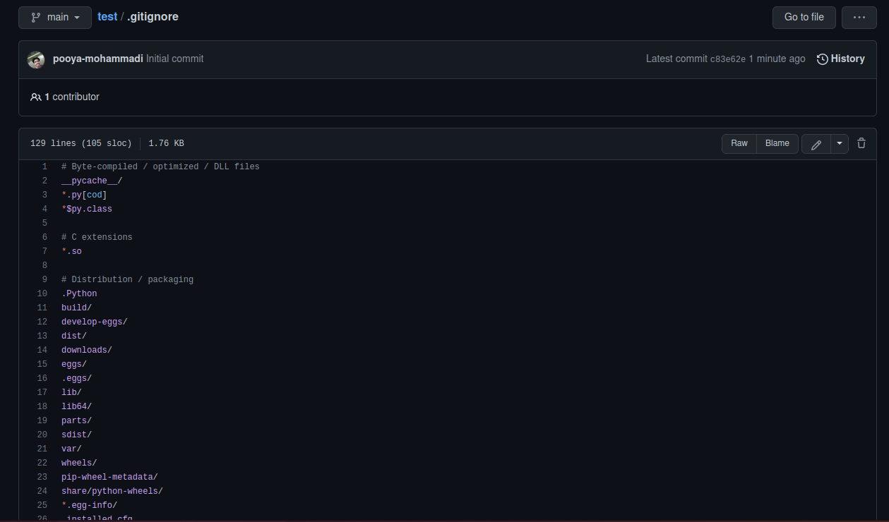
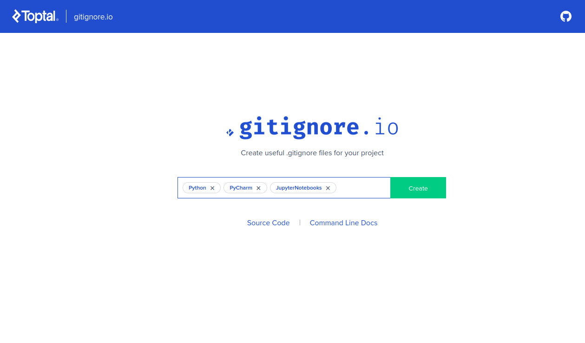

# How to ignore files and directories from unintentionally being committed

While working on a project, you may have some files or directories that you do not want them to be committed.
There are several reasons that you might not want to add some files to your repository:
1) A huge dataset file
2) Private files, like passwords and tokens
3) system or application specific files/configurations, like `.idea` for `pycharm` and `.ipynb_checkpoints`
4) ...


## Table of Contents
1. [Simulating a use case for gitignore](#simulating-a-use-case-for-gitignore)
2. [How to add .gitignore at the time of project creation in GitHub](#how-to-add-gitignore-at-the-time-of-project-creation-in-github)
3. [How to create .gitignore for various use cases](#how-to-create-gitignore-for-various-use-cases)


## Simulating a use case for gitignore
To make sure that these unwanted files will not unintentionally be committed, you should append your files
and directories' paths to a file called `.gitignore`. This file is recognized by `git`, and whenever a file's 
name appears in it, the `git`, simply, ignores it and does not even show in the output of the `status` command.

For the sake of this project, consider that we have a directory that contains a text file including some passwords. 
To make it more realistic, imagine that you are working in a team and these passwords are unique for each developer. 
Therefore, by committing this file you may overwrite others passwords our reveal yours, which both of them should be 
avoided!


So, first let's create a folder with a text file in linux:</br>
```
cd git_01
mkdir credentials
cd credentials
cat >> credentials.txt
username: pooya-mohammadi
password: **************
```


**Note**: If you are Windows user, simply graphically create a directory including a text file containing the following 
text or what ever text you desire:)
```
username: pooya-mohammadi
password: **************
```

Let's see the output of the `git status` command:</br>


As you can see, the `git` itself is suggesting you to commit the file. If you have several files to commit, the chances 
are that you may commit `credentials` along the others by mistake.

### Create a .gitignore file
```
touch .gitignore # If you are on Windows, create a new and empty text file graphically and rename it to .gitignore
cat >> .gitignore
credentials/
cat >> .gitignore
git status
```
**Note**: create an empty text file in windows




**Image Notes:**
1) make sure the spelling of `.gitignore` is correct!
2) If you are a Windows user, create a text file with no `.txt` extension, open the file as a `txt` file, and type `credentials/` in it. 
3) The `.gitignore` file is recognized by the `git` and the suggestion for committing `credentials` directory is removed.

### Add the .gitignore file, so everyone can benefit from it
```gitignore
git add .gitignore
git commit -m "Add credentials directory to gitignore"
git push origin main
git status
```


Done! With this, everyone can benefit from this file!

## How to add .gitignore at the time of project creation in GitHub
GitHub offers various templates for `.gitignore`. These templates are mainly based on various programing languages:




After creating your project `.gitignore` will be created automatically.


**Image Notes:**
1) I choose gitignore to be created for `python` programing language
2) There are several files specific to `python` that should not be included in projects' repositories because they system specific, like __pycache__, etc.


## How to create .gitignore for various use cases:
Consider you have a project which should be implemented in python, and your chosen IDEs are jupyter notebook and Pycharm.
In this case, ignoring specific files for python won't suffice. In this regard, there is a very useful website [https://www.toptal.com/developers/gitignore](https://www.toptal.com/developers/gitignore) that offers 
predefined templates for various IDEs and programing languages. 


**Image Notes:**
1) Simply add the programing language and IDEs that you want
2) click on `Create` to create the `gitignore` file.
3) Copy/save the output files in a .gitignore file.
4) Add the file to your project and make sure that you will not commit any specific files to your repository!

**PS:** Many thanks to [FeryET](https://github.com/FeryET) for introducing this website to me.


