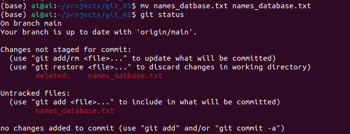
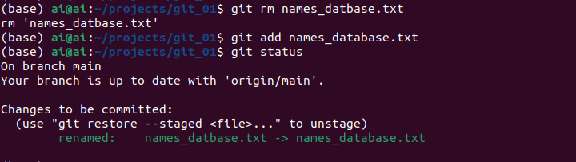
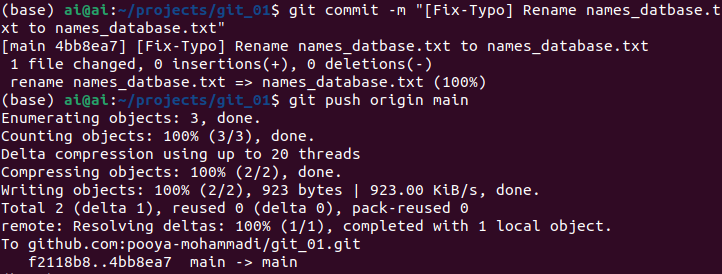

# Removing/Renaming Files

Removing & Renaming files are one of fundamental requirements any Git users would need.
For instance, you might want to correct a typo or merge two files into one file. 
There are several use cases for these two functionalities, thereby in this section, we'll cover the following items:

## Table of Contents
1. [How to remove a file](#how-to-remove-a-file)
2. [How to remove a file [Git-Style]](#how-to-remove-a-file-git-style)
3. [How to rename a file](#how-to-rename-a-file)


## How to remove a file

Before removing a file, let's create a file in the previous project which we created, namely [git_01](https://github.com/pooya-mohammadi/git_01/).

```commandline
cd git_01
touch hello_world.txt # On Windows, you can create it graphically.
git add hello_world.txt # Add to stage(one step before commiting)
git commit -m "Add hello_world.txt" # commit the changes on stage
git push origin main # push the changes to remote repository
```


Now, let's remove the file simply by deleting it:
```commandline
rm hello_world.txt # On Windows, you can remove it graphically.
git status
```


**Image Notes:**
1. `hello_world.txt` is deleted, but the changes are not staged!!
2. To restore a removed file use: `git restore <file-name>`. Using this command, you will have the exact file present on your git project/directory!
3. For adding the changes cause by removing a file you should use the following command: `git rm <file-name>`

So let's add the changes to stage:
```commandline
git rm hello_world.txt 
git status
```


**Image Notes:** 
1. the `rm` command after `git` is one of the git commands, and it works on Windows/Linux/Mac.
2. the changes now are transfered to stage, ready for being committed
3. Like always, by using `git restored --staged <file-name>` command one can restore the files which are staged!

Let's commit and push the changes:
```commandline
git commit -m "Remove hello_world.txt"
git push origin main
```


## How to remove a file [Git Style]
Git provides a way to remove files directly that you might find more convenient to use. To explore it, let's create a file like the previous step:
```commandline
cd git_01
touch hello_world.txt # On Windows, you can create it graphically.
git add hello_world.txt # Add to stage(one step before commiting)
git commit -m "Add hello_world.txt" # commit the changes on stage
git push origin main # push the changes to remote repository
```
Now, let's remove it using git:
```commandline
git rm hello_world.txt
git status
```


**Image Note:**
1. As it's shown in the image above, the file is removed directly. It's not present in the project's directory.
2. The changes are directly added to the `stage` and ready to be committed!

Let's commit and remove them:
```commandline
git commit -m "Remove hello_world.txt"
git push origin main 
```


**NOTE:** The commit is tagged as `delete mode`

## How to rename a file

Renaming a file is a bit trickier than removing it because we still want to have the file but in another name!

So as always, let's create a file with a typo in its name. We'll continue our experiments on [git_01](https://github.com/pooya-mohammadi/git_01/) project.


```commandline
cd git_01
touch names_datbase.txt #  On Windows, you can create it graphically.
git add names_datbase.txt
git commit -m "names_database.txt"
git push origin main
```


Now, let's correct the typo by renaming it!

```commandline
mv names_datbase.txt names_database.txt # On Windows, you can rename it graphically!
git status
```



**Image Notes:**
1. As it's evident, renaming a file compasses two steps:
   1. Removing it
   2. Creating a new one
2. Therefore, the previous name must be removed from git and the new one must be added!

Let's take the appropriate actions to completing the renaming process:
```commandline
git rm names_datbase.txt # remove the one with typo
git add names_database.txt # Add the new one
git status
```



As depicted in the image above, `git` finds out that a renaming is going on and tags the files as `renamed` 

The changes are applied to `stage` and they are ready to be committed:
```commandline
git commit -m "[Fix-Typo] Rename names_datbase.txt to names_database.txt"
git push origin main # push the changes to remote repository!
```


**NOTE:** Even in the commit message it mentions the renaming process!

