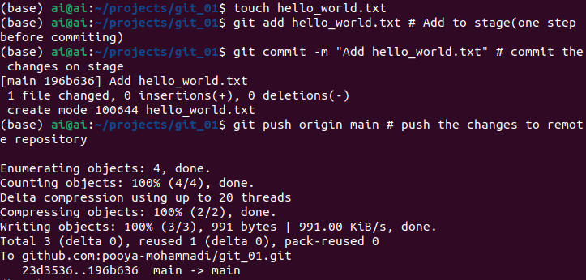
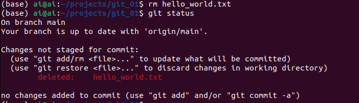
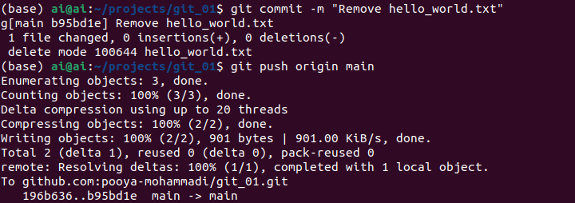

# Removing/Renaming Files

Removing & Renaming files are one of fundamental requirements any Git users would need.
For instance, you might want to correct a typo or merge two files into one file. 
There are several use cases for these two functionalities, thereby in this section, we'll cover the following items:

## Table of Contents
1. [How to remove a file](#how-to-remove-a-file)
2. [How to rename a file]


## How to remove a file

Before removing a file, let's create a file in the previous project which we created, namely [git_01](https://github.com/pooya-mohammadi/git_01/).

```commandline
cd git_01
touch hello_world.txt # On Windows, you can create it graphically.
git add hello_world.txt # Add to stage(one step before commiting)
git commit -m "Add hello_world.txt" # commit the changes on stage
git push origin main # push the changes to remote repository
```


Now, let's remove the file simply by deleting it:
```commandline
rm hello_world.txt # On Windows, you can remove it graphically.
git status
```



**Image Notes:**
1. `hello_world.txt` is deleted, but the changes are not staged!!
2. To restore a removed file use: `git restore <file-name>`. Using this command, you will have the exact file present on your git project/directory!
3. For adding the changes cause by removing a file you should use the following command: `git rm <file-name>`

So let's add the changes to stage:
```commandline
git rm hello_world.txt 
git status
```


**Image Notes:** 
1. the `rm` command after `git` is one of the git commands, and it works on Windows/Linux/Mac.
2. the changes now are transfered to stage, ready for being committed
3. Like always, by using `git restored --staged <file-name>` command one can restore the files which are staged!

Let's commit and push the changes:
```commandline
git commit -m "Remove hello_world.txt"
git push origin main
```



